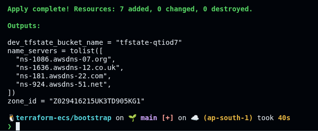
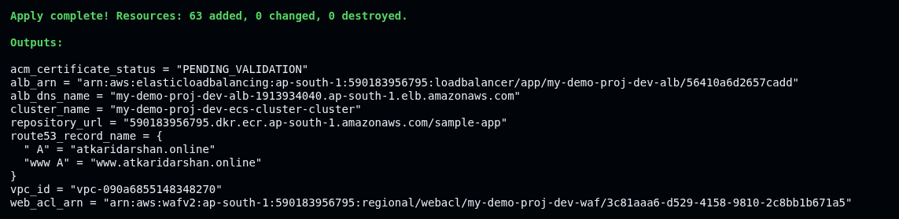
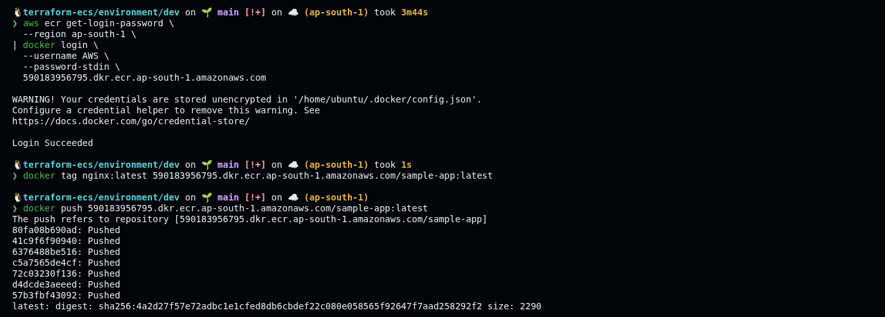
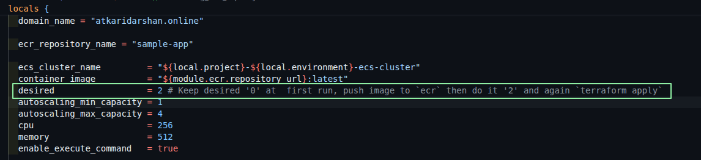
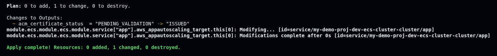
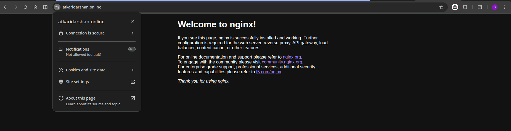
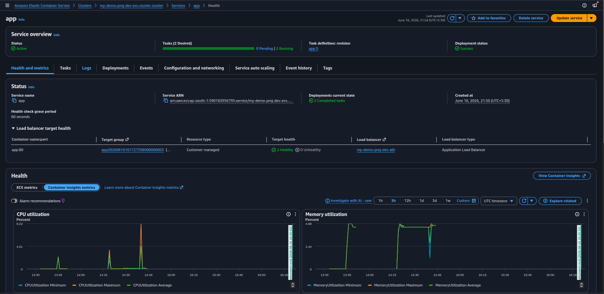
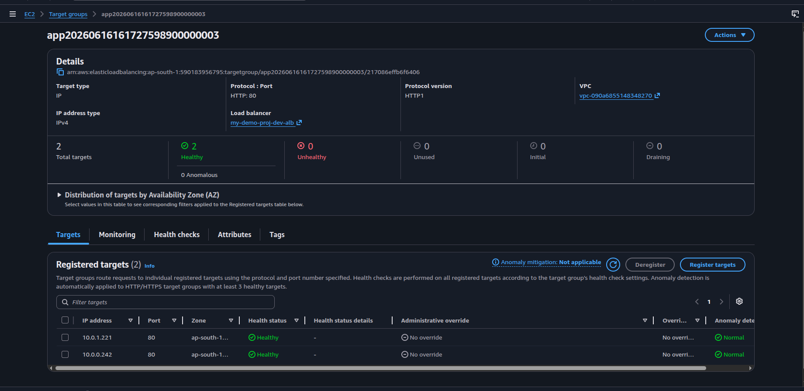

# AWS Container Platform

Production-ready infrastructure for running containerized applications on AWS ECS Fargate, provisioned entirely with Terraform. Includes a VPC, ECR, ALB with HTTPS, ACM, Route53, WAF, and auto-scaling — all wired together across reusable modules.

---

## Architecture

```
Internet
   │
   ▼
Route53 (DNS)
   │
   ▼
WAF (Web ACL — rate limiting, managed rules)
   │
   ▼
ALB  ──── HTTP → HTTPS redirect (port 80 → 443)
   │      HTTPS listener (port 443, TLS 1.3, ACM cert)
   ▼
Target Group (IP-based, health check /)
   │
   ▼
ECS Fargate Service (private subnets, auto-scaling)
   │
   ▼
ECR (container image registry)
```

**Modules**

| Module      | Purpose                                                  |
| ----------- | -------------------------------------------------------- |
| `bootstrap` | One-time setup — S3 backend bucket + Route53 hosted zone |
| `vpc`       | VPC, public/private subnets, NAT gateway                 |
| `sg`        | Security groups for ALB and ECS tasks                    |
| `acm`       | ACM TLS certificate with Route53 DNS validation          |
| `alb`       | Application Load Balancer, listeners, target group       |
| `ecr`       | ECR private repository                                   |
| `ecs`       | ECS cluster, Fargate service, auto-scaling               |
| `route53`   | A records pointing domain → ALB                          |
| `waf`       | WAF v2 Web ACL attached to ALB                           |

---

## Prerequisites

- [Terraform](https://developer.hashicorp.com/terraform/install) >= 1.5
- [AWS CLI](https://docs.aws.amazon.com/cli/latest/userguide/install-cliv2.html) configured (`aws configure`)
- [Docker](https://docs.docker.com/get-docker/) (for building and pushing the container image)
- A registered domain name (e.g. on GoDaddy, Namecheap, or any registrar)

---

## Deployment Guide

### Step 1 — Bootstrap (one-time)

The bootstrap creates the S3 bucket used as the Terraform remote backend and the Route53 hosted zone for your domain.

```bash
cd bootstrap
terraform init
terraform apply
```

You will get three outputs:

```
dev_tfstate_bucket_name = "tfstate-xxxxxx"
zone_id                 = "Z0XXXXXXXXXXXXXXXXX"
name_servers            = tolist([
  "ns-xxx.awsdns-xx.com",
  "ns-xxx.awsdns-xx.net",
  "ns-xxx.awsdns-xx.org",
  "ns-xxx.awsdns-xx.co.uk",
])
```



**→ Go to your domain registrar and replace the nameservers with the four values above.** DNS propagation can take a few minutes up to a few hours.

---

### Step 2 — Configure the environment

```bash
cd environment/dev
```

**2a. Set the backend bucket**

Open `backend.tf` and update the bucket name to match the `dev_tfstate_bucket_name` output from Step 1:

```hcl
terraform {
  backend "s3" {
    bucket = "tfstate-xxxxxx"   # ← paste your bucket name here
    key    = "dev/terraform.tfstate"
    region = "ap-south-1"
  }
}
```

**2b. Set the Route53 zone ID**

Copy `terraform.tfvars.example` to `terraform.tfvars` and paste the `zone_id` from Step 1:

```bash
cp terraform.tfvars.example terraform.tfvars
```

```hcl
# terraform.tfvars
route53_zone_id = "Z0XXXXXXXXXXXXXXXXX"
```

**2c. Set desired count to 0**

In `locals.tf`, keep `desired = 0` for the first apply — there's no container image yet:

```hcl
desired = 0  # ← leave as 0 for the initial run
```

---

### Step 3 — First `terraform apply`

```bash
terraform init
terraform validate
terraform plan
terraform apply
```



This provisions everything: VPC, ALB, ECS cluster, ECR repo, WAF, ACM cert, DNS records — but with 0 running tasks.

Note the `repository_url` from the outputs:

```
repository_url = "590183956795.dkr.ecr.ap-south-1.amazonaws.com/sample-app"
```

---

### Step 4 — Build and push your container image to ECR

```bash
# Authenticate Docker to ECR
aws ecr get-login-password --region ap-south-1 \
  | docker login --username AWS --password-stdin \
    590183956795.dkr.ecr.ap-south-1.amazonaws.com

# Tag it
docker tag nginx:latest \
  590183956795.dkr.ecr.ap-south-1.amazonaws.com/sample-app:latest

# Push it
docker push \
  590183956795.dkr.ecr.ap-south-1.amazonaws.com/sample-app:latest
```



---

### Step 5 — Start the ECS service

In `locals.tf`, update `desired` to the number of tasks you want running:

```hcl
desired = 2  # ← set to your desired task count
```



Then apply again:

```bash
terraform apply
```



ECS will pull the image from ECR, register the tasks with the target group, and start serving traffic.

---

### Step 6 — Verify

Open your browser and navigate to your domain:

```
https://atkaridarshan.online
```

The app should be live and served over HTTPS.



**Console verification**

ECS service with tasks running and registered to the target group:



Target group showing healthy targets:



---

## Repository Structure

```
aws-container-platform/
├── bootstrap/               # One-time setup: S3 backend + Route53 hosted zone
│   └── main.tf
├── environment/
│   └── dev/                 # Dev environment entry point
│       ├── backend.tf
│       ├── locals.tf
│       ├── main.tf
│       ├── outputs.tf
│       ├── providers.tf
│       ├── variables.tf
│       └── terraform.tfvars
├── modules/
│   ├── acm/                 # ACM certificate + Route53 DNS validation
│   ├── alb/                 # ALB, listeners, target group
│   ├── ecr/                 # ECR private repository
│   ├── ecs/                 # ECS cluster + Fargate service + auto-scaling
│   ├── route53/             # Route53 A records
│   ├── sg/                  # Security groups (ALB + ECS)
│   ├── vpc/                 # VPC, subnets, NAT gateway
│   └── waf/                 # WAF v2 Web ACL
└── docs/assets/                  # Screenshots
```

---

## Configuration Reference

Key values are set in `environment/dev/locals.tf`:

| Local                      | Description                           | Default        |
| -------------------------- | ------------------------------------- | -------------- |
| `project`                  | Project name prefix for all resources | `my-demo-proj` |
| `environment`              | Environment label                     | `dev`          |
| `vpc_cidr`                 | VPC CIDR block                        | `10.0.0.0/16`  |
| `container_port`           | Port the container listens on         | `80`           |
| `ecr_repository_name`      | ECR repo name                         | `sample-app`   |
| `desired`                  | Number of ECS tasks                   | `2`            |
| `cpu`                      | Fargate task CPU units                | `256`          |
| `memory`                   | Fargate task memory (MiB)             | `512`          |
| `autoscaling_min_capacity` | Minimum tasks                         | `1`            |
| `autoscaling_max_capacity` | Maximum tasks                         | `4`            |

Auto-scaling triggers:

- Scale out when average CPU > 70%
- Scale out when average memory > 80%

WAF rules applied (in priority order):

1. Rate limit — block IPs exceeding 1000 req / 5 min
2. AWS Managed Common Rule Set (XSS, HTTP anomalies, scanners)
3. Known Bad Inputs (log4j, Spring4Shell, etc.)
4. Linux Rule Set
5. Amazon IP Reputation List

---

## Docs

Detailed configuration reference for individual modules:

- [ECR — image types, tag mutability, lifecycle policy, scanning](docs/ecr.md)
- [ECS — IAM roles, task definition, ALB integration, auto-scaling](docs/ecs.md)

---

## Teardown

```bash
# Remove the dev environment
cd environment/dev
terraform destroy

# Remove bootstrap resources (deletes the S3 bucket and Route53 zone)
cd ../../bootstrap
terraform destroy
```

> **Note:** The S3 bucket has versioning enabled. Set `force_destroy = true` in `bootstrap/main.tf` before destroying if the bucket is non-empty.
